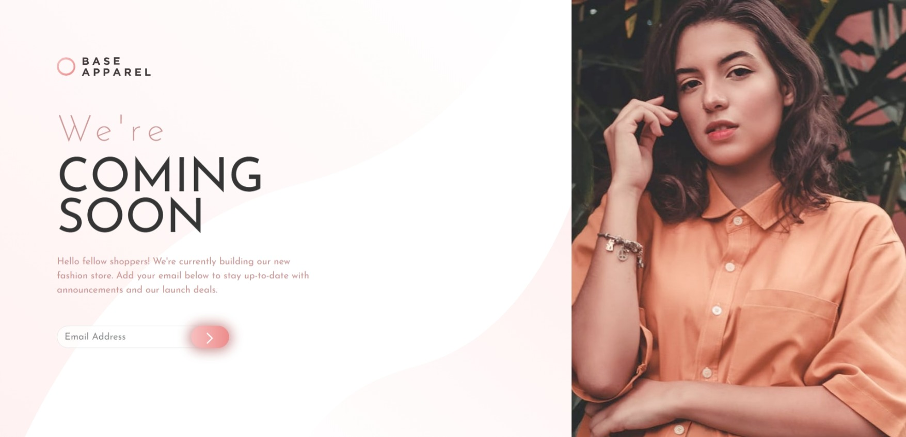

# Frontend Mentor - Base Apparel coming soon page solution

This is a solution to the [Base Apparel coming soon page challenge on Frontend Mentor](https://www.frontendmentor.io/challenges/base-apparel-coming-soon-page-5d46b47f8db8a7063f9331a0). Frontend Mentor challenges help you improve your coding skills by building realistic projects. 
## Table of contents

- [Overview](#overview)
  - [Screenshot](#screenshot)
  - [Links](#links)
- [My process](#my-process)
  - [Built with](#built-with)
  - [What I learned](#what-i-learned)

- [Author](#author)

## Overview

### Screenshot

 
 

### Links

- Solution URL: [solution URL](https://github.com/anassreda/base-apparel-coming-soon-master)
- Live Site URL: [live site URL](https://anassreda.github.io/base-apparel-coming-soon-master/)

### Built with

- Semantic HTML5 markup
- CSS custom properties
- Mobile-first workflow
- [Bootstrap] v5 

### What I learned
Grid System:

Bootstrap's grid system uses a series of containers, rows, and columns to layout and align content.
It is built with flexbox and is fully responsive.
The grid system is based on a 12-column layout.
Creating a Grid Layout:

Use the .container class to create a responsive fixed-width container.
Use the .row class to create a horizontal group of columns.
Define columns inside the row using classes like .col, .col-sm-4, .col-md-6, etc.
Columns can be resized, offset, and nested as needed.
Flexbox Utilities:

Bootstrap includes a set of flexbox utilities for controlling the layout and alignment.
These utilities include classes like .d-flex, .justify-content-center, .align-items-center, etc.
Flex properties can be applied to create complex layouts easily.
Combining Grid and Flexbox:

Flexbox utilities can be used within grid layouts to achieve more flexible and responsive designs.
For example, you can center content within a column using flexbox utilities.
Responsive Design:

Bootstrap's grid and flexbox system are designed to be responsive, ensuring that the layout adjusts to different screen sizes.
Use breakpoint-specific classes to control the layout for different devices.

### Continued development

Breakpoints: Master using breakpoints to create layouts that adapt seamlessly to different screen sizes.
Visibility Utilities: Learn to use visibility utilities like .d-none, .d-sm-block, etc., to control the visibility of elements at different breakpoints.
Interactive Components: Work more with interactive components like modals, carousels, and tooltips.
Form Components: Refine the use of Bootstrap’s form components to create responsive and accessible forms.

## Author
- Frontend Mentor - [@anassreda](https://www.frontendmentor.io/profile/anassreda)
- X - [@anass_el_gh](https://x.com/anass_el_gh)

